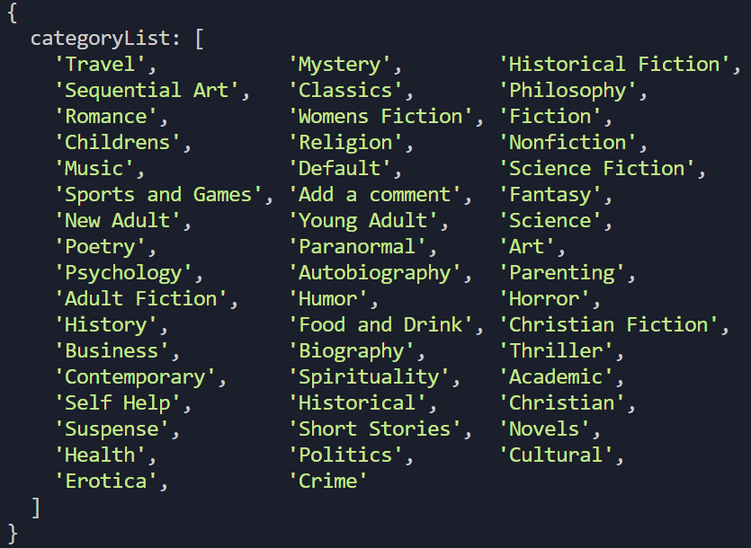
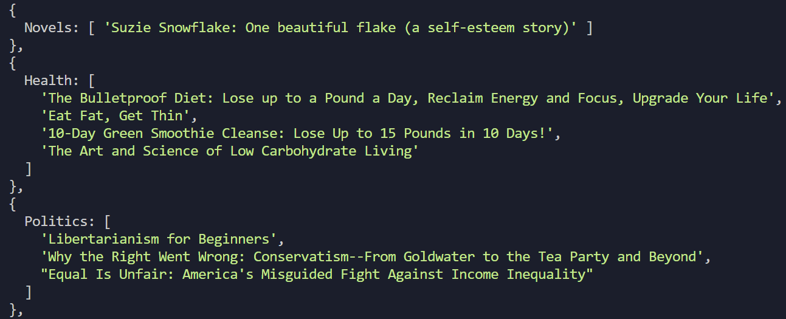
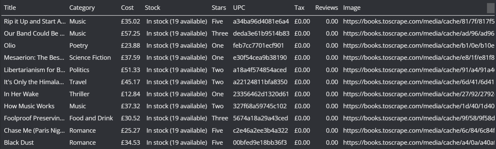

# Books Scraper

This is a book scraper built with Node.js using the Puppeteer library. The scraper is designed to extract information from a specified book website, providing various features for data extraction and analysis.

- What's Special about this ?
This scraper performs browser automation over a book's website with 50 pages, each page containing around 20 books, so this can scrape over 1000 books in just few minutes and display formatted data for easy analysis and use.

## Main Features:

### 1. Get all categories:
   This option allows you to scrape all the categories from the website and display the information in JSON format.
   

### 2. Get all books in a category:
   This feature extracts all books within a specified category, creating a list for each category. The scraper then supplies the data in JSON format, organized by category along with their respective book lists.
   

### 3. Book details:
   The most comprehensive option, this feature scrapes details for every book (Title, Category, Cost, Stock, Stars, UPC, Tax, Reviews, Image) from the specified website. The data is then appended to a CSV file, located in the repository under the "extractedData" folder, named "bookData.csv". Additionally, the scraper displays the data in a formatted table for further analysis.
   

## Technology Used:

- **Node.js:**
  A JavaScript runtime for executing server-side code.

- **Puppeteer:**
  A Node library that provides a high-level API to control headless browsers and facilitate browser automation.

## Scraped from:
[https://books.toscrape.com/index.html](https://books.toscrape.com/index.html)

Feel free to explore this project and contact me in case of any doubts [manraj.saini123@gmail.com]